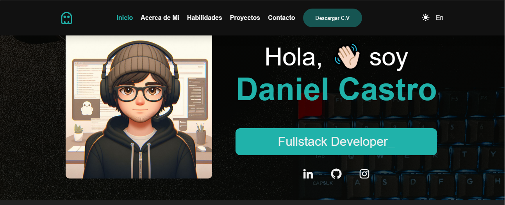
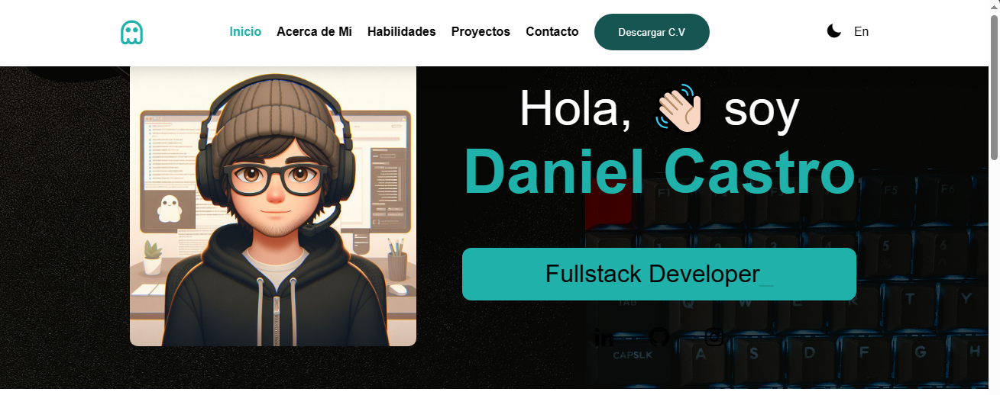

# Mi Portafolio

Este es mi portafolio personal, donde muestro mis proyectos, habilidades y experiencia. Aquí encontrarás información sobre mí y los enlaces a mis proyectos más destacados.
El portafolio esta diseñado para adaptarse a diferentes dispositivos.

## Contenido
- Hero
- Sobre Mi
- Habilidades
- Proyectos 
- Contacto

## Tecnologías

- HTML
- CSS
- JavaScript

## Instalación

1. Clona este repositorio: `git clone https://github.com/DAlejandroCastro/taller-portafolio`
2. Abre el archivo `index.html` en tu navegador.

## Contacto

Si deseas contactarme, puedes enviarme un correo electrónico a alejocastro322@gmail.com o encontrarme en LinkedIn.

¡Gracias por visitar mi portafolio!